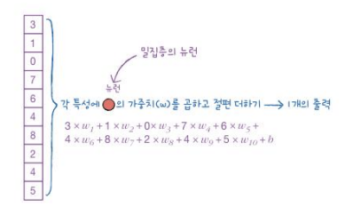
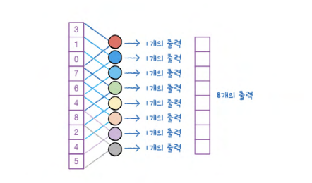
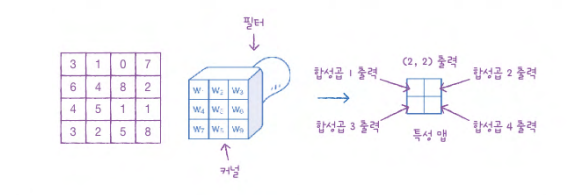
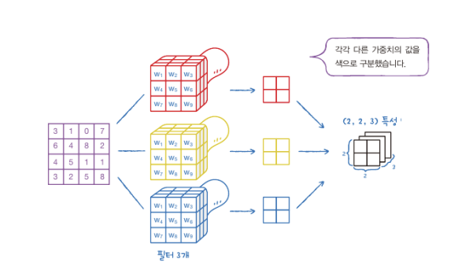
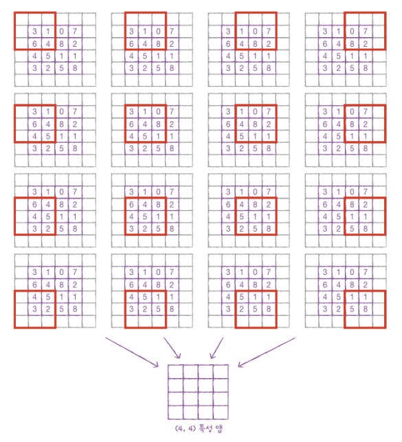
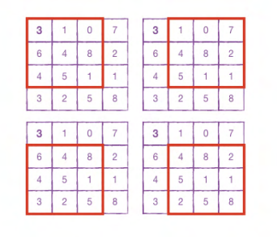
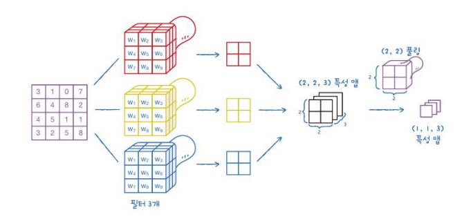
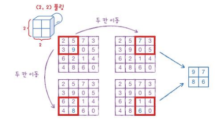
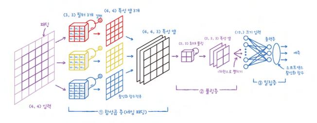

# 7-3 신경망 모델 훈련
## 손실 곡선
```python
model.compile(loss='sparse_categorical_crosssentropy', metrics='accuracy')
history = model.fit(train_scaled, train_target, epochs=5, verbose=0)
print(history.history.keys())
```
```python
dict_keys(['loss', 'accuracy'])
```


```python
plt.plot(history.history['loss'])
plt.xlabel('epoch')
plt.ylabel('loss')
plt.show()
```

```python
plt.plot(history.history['accuracy'])
plt.xlabel('epoch')
plt.ylabel('accuracy')
plt.show()
```


- `history` 객체에는 훈련 측정값이 담겨 있는 `history` 딕셔너리가 들어 있고, 해당 딕셔너리에는 손실 `loss`와 정확도 `accuracy`값 들어 있음
- 에포크보다 손실이 감소하고 정확도 향상

## 더 많은 에포크
### 검증 손실
- 에포크에 대한 과대적합과 과소적합 파악하려면 훈련 세트에 대한 점수 뿐만 아니라 검증 세트에 대한 점수도 필요
- 에포크마다 검증 손실 계산하기 위한 케라스 모델의 `fit()` 메서드에 검증 데이터 전달 

    
    > 인공 신경망 모델이 최적화하는 대상은 정확도가 아닌 **손실함수**이므로, 손실 감소에 비례하여 정확도가 높아지지 않는 경우도 있음

    ```python
    model = model_fn()
    model.compile(loss='sparse_categorical_crossentropy', metrics='accuracy')
    history = model.fit(train_scaled, train_target, epochs=20, verbose=0, validation_data(val_scaled, val_target))
    > 검증 세트에 대한 손실은 `val_loss`에 들어 있고 정확도는 `val_accuracy`에 들어 있음
    ```

    

### 옵티마이저
- 과대적합을 막기 위한 신경망 특화 규제 방법
- `Adam 옵티마이저`는 적응적 학습률을 사용하기 때문에, 에포크가 진행되면서 학습률 크기 조정 가능

    
    > 열 번째 에포크까지 전반적인 감소 추세 이어지므로, 과대적합 감소


## 드롭아웃
- 훈련 과정에서 층에 있는 일부 뉴런을 랜덤하게 껴서 (즉 뉴런의 출력을 0으로 만들어) 과대 적합을 방지하는 방법
- 이전 층의 일부 뉴런이 랜덤하게 꺼지면 특정 뉴런에 과대하게 의존하는 것을 줄일 수 있고 모든 입력에 대해 주의 기울여야 함
- `keras.layers` 패키지 아래 `Dropout` 클래스 활용
    
    

- 은닉층 뒤에 추가된 드롭아웃 층(Dropout)은 훈련되는 모델 파라미터가 없고, 입력과 출력 크기 동일
    

- 드롭아웃은 훈련이 끝난 뒤에 평가나 예측 수행할 때는 적용하지 말아야 하므로, 텐서플로와 케라스는 모델을 평가와 예측에 사용할 때 드롭아웃 미적용
    


## 콜백
- 훈련 과정 중간에 어떤 작업을 수행할 수 있게 하는 객체로 `keras.callbacks` 패키지 아래의 클래스
- 최상의 검증 점수 만드는 모델 저장
- 모델이 훈련한 후에 `best-moodel.h5`에 최상의 검증 점수 낸 모델 저장

```python
model = model_fn(keras.layers.Dropout(0.3))
model.compile(optimizer='adam', loss='sparse_categorical_crossentropy', metrics='accuracy')
checkout_cb = keras.callbacks.ModelCheckpoint('best=model.h5')
model.fit(train_scaled, train_target, epochs=20, verbose=0, validation_data=(val_scaled, val_target), callbacks=[checkpoint_cb])
```

## 조기 종료 (Early Stopping)
- 과대적합이 시작되기 전에 훈련 미리 중지하는 것
- 검증 점수가 상승하기 시작하면 그 이후에 과대적합이 더 커지기 때문에 훈련 계속할 필요 없음
- 훈련 에포크 횟수 제한하는 역할이지만 모델이 과대적합되는 것 막아주는 규제 방법

> EarlyStopping 콜백을 ModelCheckpoint 콜백과 함께 사용하는 가장 낮은 검증 손실의 모델을 파일에 저장하고 검증 손실이 다시 상승할 때 훈련 중지

```python
model = model_fn(keras.layers.Dropout(0.3))
model.compile(optimizer='adam', loss='sparse_categorical_crossentropy', metrics='accuracy')
checkpoint_cb = keras.callbacks.ModelCheckpoint('best-model.h5')
early_stopping_cb = keras.callbacks.EarlyStopping(patience=2, restore_best_weights=True)
history = model.fit(train_scaled, train_target, epochs=20, verbose=0, validation_data=(val_scaled, val_target), callbacks=[checkpoint_cb, early_stopping_cb])
```

> patience를 2로 지정하면 2번 연속 검증 점수가 향상되지 않으면 훈련 중지


# 8-1 합성곱 신경망의 구성 요소
## 합성곱
- 데이터에 마법의 도장을 찍어서 유용한 특성만 드러나게 하는 것
- 입력 데이터 전체에 가중치 적용하는 밀집층의 계산과 다르게 일부에 가중치 곱함
    
    
    > **밀집층**: 10개의 가중치 가지고 1개의 출력 만듦

    
    > **합성곱**: 3개 가중치 가지고 8개의 출력 만듦

- 합성곱에서는 뉴런이 입력 위를 이동하면서 출력 만들기 때문에 `뉴런`을 `필터` 혹은 가중치`커널`이라고 부름


## 2차원 합성곱
- 합성곱 신경망의 특징은 2차원 이미지 그대로 사용, 처리할 수 있다는 장점
- `3X3` 이나 `4x4` 2차원 입력을 1차원으로 펼치지 않고, 2차원 커널을 가진 필터에 그대로 합성곱 수행
- 각 커널에 대하여 동일한 가중치 곱하여 슬라이딩 하면서 출력

### 특성맵


### 여러 개의 필터
- 필터 마다의 가중치, 절편 모두 서로 다름
- 필터 여러 개 적용하면, 3차원 특성맵 생성 

    


## 케라스 합성곱 층
```python
from tensorflow import keras

# 필터 개수 10개, 활성화 함수로 렐루함수 사용
keras.layer.Con2D(10, kernel_size=(3,3), activation='relu')
```

### 패딩

- 합성곱 입력에 주변에 1개의 픽셀을 덧붙이는 것
- 필터가 슬라이딩하는 위치 늘려주는 효과
- 0으로 패딩되기 때문에 계산된 값에는 영향 미치지 못하지만 슬라이딩 위치 늘려줌

- **목적: 주변 픽셀의 정보 잘 감지하기 위해서**

```python
keras.layers.Con2D(10, kernel_size=(3,3), activation='relu', padding='same')
```
- `same padding` 방식 주로 사용
- `valid padding`은 패딩 없이 순수한 입력 배열에서만 합성곱 사용하여 특성 맵 만드는 경우

### 스트라이드

- 기존의 합성곱 연산이 좌우, 위아래로 한 칸씩 이동한 것과 다르게 이동의 크기 `스트라이드` 지정 가능

```python
keras.layers.Con2D(10, kernel_size=(3,3), activation='relu', padding='same', strides=1)
```

### 풀링

- 합성곱 층에서 만든 특성맵의 가로 세로 크기를 줄이는 역할 수행
- 특성 앱에 커널 없는 필터를 적용하는 것과 비슷한 효과
- 예를 들어 `2X2` 픽셀이 하나의 픽셀로 압축되는 효과
- `가중치` 적용하지 않음
- `슬라이딩`과 달리 겹쳐서 (중복) 이동하지 않음

    

**평균 풀링**
- 도장을 찍은 영역에서 평균값 계산

**최대 풀링**
- 도장을 찍은 영역에서 가장 큰 값 선택

```python
keras.layers.MaxPooling2D(2)

# 풀링의 크기에 맞게 스트라이드 자동 지정
keras.layers.MaxPooling2D(2, strides=2, padding='valid')
```

## 합성곱 신경망 전체 구조
