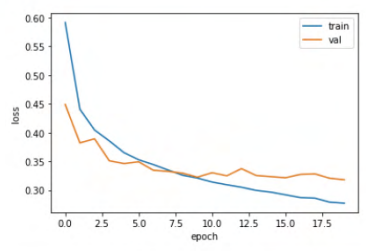

# 7-3 신경망 모델 훈련
## 손실 곡선
```python
model.compile(loss='sparse_categorical_crosssentropy', metrics='accuracy')
history = model.fit(train_scaled, train_target, epochs=5, verbose=0)
print(history.history.keys())
```
```python
dict_keys(['loss', 'accuracy'])
```


```python
plt.plot(history.history['loss'])
plt.xlabel('epoch')
plt.ylabel('loss')
plt.show()
```

```python
plt.plot(history.history['accuracy'])
plt.xlabel('epoch')
plt.ylabel('accuracy')
plt.show()
```


- `history` 객체에는 훈련 측정값이 담겨 있는 `history` 딕셔너리가 들어 있고, 해당 딕셔너리에는 손실 `loss`와 정확도 `accuracy`값 들어 있음
- 에포크보다 손실이 감소하고 정확도 향상

## 더 많은 에포크
### 검증 손실
- 에포크에 대한 과대적합과 과소적합 파악하려면 훈련 세트에 대한 점수 뿐만 아니라 검증 세트에 대한 점수도 필요
- 에포크마다 검증 손실 계산하기 위한 케라스 모델의 `fit()` 메서드에 검증 데이터 전달 

    
    > 인공 신경망 모델이 최적화하는 대상은 정확도가 아닌 **손실함수**이므로, 손실 감소에 비례하여 정확도가 높아지지 않는 경우도 있음

    ```python
    model = model_fn()
    model.compile(loss='sparse_categorical_crossentropy', metrics='accuracy')
    history = model.fit(train_scaled, train_target, epochs=20, verbose=0, validation_data(val_scaled, val_target))
    > 검증 세트에 대한 손실은 `val_loss`에 들어 있고 정확도는 `val_accuracy`에 들어 있음
    ```

    

### 옵티마이저
- 과대적합을 막기 위한 신경망 특화 규제 방법
- `Adam 옵티마이저`는 적응적 학습률을 사용하기 때문에, 에포크가 진행되면서 학습률 크기 조정 가능

    
    > 열 번째 에포크까지 전반적인 감소 추세 이어지므로, 과대적합 감소


## 드롭아웃
- 훈련 과정에서 층에 있는 일부 뉴런을 랜덤하게 껴서 (즉 뉴런의 출력을 0으로 만들어) 과대 적합을 방지하는 방법
- 이전 층의 일부 뉴런이 랜덤하게 꺼지면 특정 뉴런에 과대하게 의존하는 것을 줄일 수 있고 모든 입력에 대해 주의 기울여야 함
- `keras.layers` 패키지 아래 `Dropout` 클래스 활용
    
    

- 은닉층 뒤에 추가된 드롭아웃 층(Dropout)은 훈련되는 모델 파라미터가 없고, 입력과 출력 크기 동일
    

- 드롭아웃은 훈련이 끝난 뒤에 평가나 예측 수행할 때는 적용하지 말아야 하므로, 텐서플로와 케라스는 모델을 평가와 예측에 사용할 때 드롭아웃 미적용
    


## 콜백
- 훈련 과정 중간에 어떤 작업을 수행할 수 있게 하는 객체로 `keras.callbacks` 패키지 아래의 클래스
- 최상의 검증 점수 만드는 모델 저장
- 모델이 훈련한 후에 `best-moodel.h5`에 최상의 검증 점수 낸 모델 저장

```python
model = model_fn(keras.layers.Dropout(0.3))
model.compile(optimizer='adam', loss='sparse_categorical_crossentropy', metrics='accuracy')
checkout_cb = keras.callbacks.ModelCheckpoint('best=model.h5')
model.fit(train_scaled, train_target, epochs=20, verbose=0, validation_data=(val_scaled, val_target), callbacks=[checkpoint_cb])
```

## 조기 종료 (Early Stopping)
- 과대적합이 시작되기 전에 훈련 미리 중지하는 것
- 검증 점수가 상승하기 시작하면 그 이후에 과대적합이 더 커지기 때문에 훈련 계속할 필요 없음
- 훈련 에포크 횟수 제한하는 역할이지만 모델이 과대적합되는 것 막아주는 규제 방법

> EarlyStopping 콜백을 ModelCheckpoint 콜백과 함께 사용하는 가장 낮은 검증 손실의 모델을 파일에 저장하고 검증 손실이 다시 상승할 때 훈련 중지

```python
model = model_fn(keras.layers.Dropout(0.3))
model.compile(optimizer='adam', loss='sparse_categorical_crossentropy', metrics='accuracy')
checkpoint_cb = keras.callbacks.ModelCheckpoint('best-model.h5')
early_stopping_cb = keras.callbacks.EarlyStopping(patience=2, restore_best_weights=True)
history = model.fit(train_scaled, train_target, epochs=20, verbose=0, validation_data=(val_scaled, val_target), callbacks=[checkpoint_cb, early_stopping_cb])
```

> patience를 2로 지정하면 2번 연속 검증 점수가 향상되지 않으면 훈련 중지


# 8-1 합성곱 신경망의 구성 요소