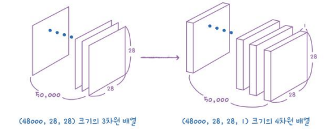
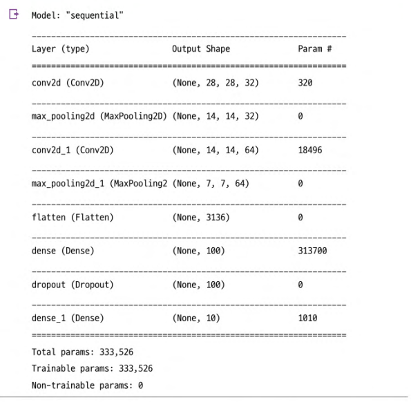
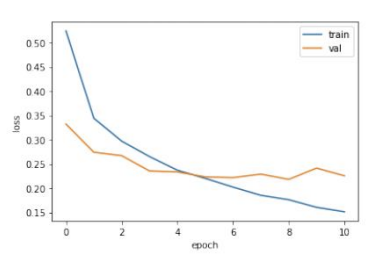
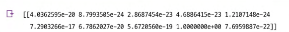
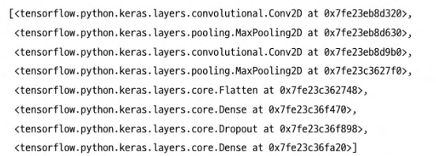
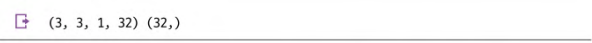
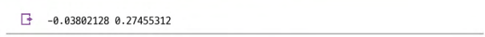
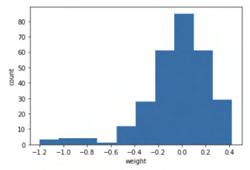
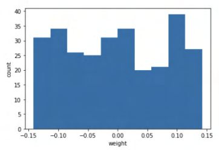
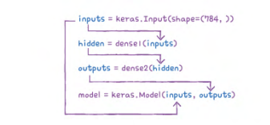

# 8-2 합성곱 신경망을 사용한 이미지 분류

## 패션 MNIST 데이터 불러오기
```python
from tensorflow import keras
from sklearn.model_selection import train_test_split

(train_input, train_target), (test_input, test_target) = keras.datasets.fashion_mnist.load_data()

train_scaled = train_input.reshape(-1, 28, 28, 1) / 255.0
train_sclaed, val_scaled, train_target, val_target = train_test_split(train_scaled, train_target, test_size=0.2, random_state=42)
```

- (48000, 28, 28) 크기인 train_input을 (48000, 28, 28, 1) 크기로 스케일링 수행

    


## 합성곱 신경망 만들기
### 첫번째 합성곱 추가
```python
model = keras.Sequential()

model.add(keras.layers.Conv2D(32, kernel_size=3, activation='relu', padding='same', input_size=(28, 28, 1)))
```
- **32개의 필터** 사용
- 커널 크기는 **(3, 3)**
- **relu** 활성화 함수, **same** padding 사용
- input_shape는 패션 이미지를 3차원에서 4차원으로 스케일링하였으므로, (28, 28) 대신 (28, 28, 1)의 **3차원 형식**


### 풀링층 추가
```python
model.add(keras.layers.MaxPooling2D(2))
```
- 최대 풀링층 추가하고, 전형적인 풀링 크기인 (2,2) 풀링 사용
- 32개의 필터 사용하므로, 특성 맵의 깊이는 **32**
- 특성맵의 크기는 절반으로 줄어들게 되므로 **(14, 14, 32)**


### 두번째 합성곱-풀링층 추가
```python
model.add(keras.layers.Conv2D(64, kernel_size=3, activation='relu', padding='same'))

model.add(keras.layers.MaxPooling2D(2))
```
- 필터 개수 64개로 늘리고, 동일하게 **relu** 함수와 **same padding** 사용
- 풀링층 적용하여 특성 맵의 크기 **(7, 7, 64)**


### 3차원 특성맵 펼치기
```python
model.add(keras.layers.Flatten())
model.add(keras.layers.Dense(100, activation='relu'))
model.add(keras.layers.Dropout(0,4))
model.add(keras.layers.Dense(10, activation='softmax'))
```
- 마지막에 10개의 뉴런 가진 밀집출력층에서 확률 계산
- 특성맵 펼쳐서 출력층 전달하기 전에, Dense 은닉층 추가
- Dropout 추가하여 은닉층의 과대적합 막아 성능 개선

### 최종 모델



### 모델 컴파일과 훈련
```python
model.compile(optimizer='adam', loss='sparse_categorical_crossentropy', metrics='accuracy')

checkpoint_cb = keras.callbacks.ModelCheckpoint('best-cnn-model.h5', save_best_only=True)

early_stopping_cb = keras.callbacks.EarlyStopping(patiece=2, restore_best_weights=True)

history = model.fit(train_scaled, train_target, epochs=20, validation_data=(val_scaled, val_target), callbacks=[checkpoint_cb, early_stopping_cb])
```
- Adam 옵티마이저 사용하여 최적화
- ModelCheckpoint 콜백과 EarlyStopping 콜백 사용하여 조기 종료 기법 구현


### 성능 시각화


### 예측
```python
preds = model.predict(val_scaled[0:1])
print(preds)
```

- 각 클래스에 대한 확률 값 반환
- 가장 높은 예측 확률을 가진 클래스로 예측


# 8-3 합성곱 신경망의 시각화
## 가중치 시각화
```python
from tensorflow import keras

model = keras.models.load_model('best=cnn-model.h5')
model.layers
```


```python
conv = model.layers[0]
print(conv.weights[0].shape, conv.weights[1].shape)
```


- 첫번째 합성곱 층의 가중치 조사하기 위한 방법
- 층의 가중치와 절편은 층의 **weights 속성**에 저장
- **가중치** : (3, 3, 1, 32) 커널 크기를 (3, 3)으로 지정했으므로
- **원소 (절편)** : (32, ) 필터마다 1개의 절편 있으므로 

```python
conv_weights = conv.weights[0].numpy()
print(conv_weigths.mean(), conv_weights.std())
```

- 가중치 배열의 평균, 표준편차 계산


### 빈 합성곱 신경망과의 가중치 비교

- 평균 0을 중심으로 종 모양 분포 가짐


- 평균은 이전과 동일하게 0에 가깝지만, 표준편차는 매우 작음
- tensorflow가 신경망의 가중치 처음 초기화할 때 균등 분포에서 랜덤하게 값 선택하기 때문


## 함수형 API
> 케라스의 Model 클래스를 사용하여 모델 생성

```python
dense1 = keras.layers.Dense(100, activation='sigmoid')
dense2 = keras.layers.Dense(10, activation='softmax')
```
- 2개의 Dense 층 객체 생성

```python
inputs = keras.Input(shape=(784,))
hidden = dense1(inputs)
outputs = dense2(hidden)

model - keras.Model(inputs, outputs)
```
- 케라스가 제공하는 Input() 함수를 사용하면 InputLayer 클래스 객체를 만들어 출력 반환
- 입력값 inputs를 Dense 층에 통과시킨 후 출력값 hidden 생성
- 첫번째 층의 출력 hidden을 입력으로 사용
- inputs와 outputs를 Model 클래스로 연결




## 특성맵 시각화