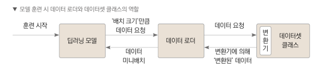
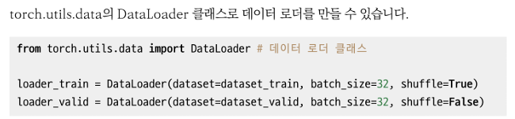
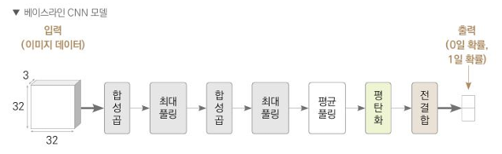
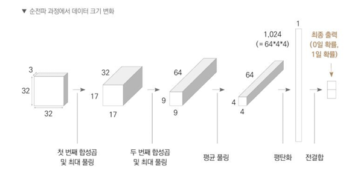
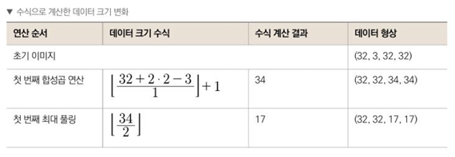
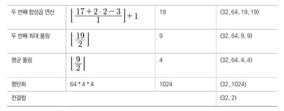

# 항공사진
## 베이스라인 모델

### 1. 시드값 고정 및 GPU 장비 설정
- 파이토치 임포트하고 시드값 고정
- 시드값 고정하는 이유는 다시 실행해도 같은 결과 얻기 위해서

- 연산에 이용할 장비 할당
```python
if torch.cuba.is_available():
    device = torch.device('cuba')
else:
    device = torch.device('cpu')
```


### 2. 데이터 준비


1. 훈련/검증 데이터 분리
```python
train, valid = train_test_split(lables, test_size=0.1, stratify=labels['has_cactus'], random_state=50)
```
- 훈련, 검증 데이터 타깃값 비율 설정

2. 데이터셋 클래스 정의
```python
class ImageDataset(Dataset):
    
    # 생성자
    def __init__(self, df, img_dir='./', transform=None):
        self.df = df
        self.img_dir = img_dir
        self.transform = transform
    
    # 데이터셋 크기 반환
    def __len__(self):
        return len(self.df)
    
    # 인덱스에 해당하는 데이터 반환
    def __getitem__(self, idx):
        img_id = self.df.iloc[idx, 0]
        img_path = self.img_dir + img_id
        image = cv2.imread(img_path)
        image = cv2.cvtColor(image, cv2.COLOR_BGR2RGB)
        label = self.df.iloc[idx, 1]

        if self.transform is not None:
            image = self.transform(image)
        return image, label
```
- 추상클래스 Dataset 오버라이딩 필요

```python
from torchvision import transforms

transform = transforms.ToTensor()
```
- 파이토치 모델로 이미지 다루기 위해서 이미지 데이터 tensor 타입으로 변환
- (가로, 세로, 채널) -> (채널, 가로, 세로) 픽셀 형상으로 변경

3. 데이터셋 생성   
```python
dataset_train = ImageDataset(df=train, img_dir='train/', transform=transform)

dataset_valid = ImageDataset(df=valid, img_dir='train/', transform=transform)
```

4. 데이터 로더 생성
- 지정한 배치 크기 만큼씩 데이터 불러오는 객체



### 3. 모델 생성
**합성곱 신경망(CNN) 모델**



```python
import torch
import torch.nn as nn
import torch.nn.functional as F

class Model(nn.Module):
    def __init__(self):
        super().__init__()
        
        # 첫 번째 합성곱 계층 정의
        self.conv1 = nn.Conv2d(in_channels=3, out_channels=32, kernel_size=3, padding=2)
        
        # 두 번째 합성곱 계층 정의
        self.conv2 = nn.Conv2d(in_channels=32, out_channels=64, kernel_size=3, padding=2)
        
        # 최대 풀링 계층 정의
        self.max_pool = nn.MaxPool2d(kernel_size=2)
        
        # 평균 풀링 계층 정의
        self.avg_pool = nn.AvgPool2d(kernel_size=2)
        
        # 완전 연결 계층 정의
        self.fc = nn.Linear(in_features=64 * 4 * 4, out_features=2)

    def forward(self, x):
        # 첫 번째 합성곱 계층을 통과시키고 ReLU 활성화 함수 적용
        x = self.max_pool(F.relu(self.conv1(x)))
        
        # 두 번째 합성곱 계층을 통과시키고 ReLU 활성화 함수 적용
        x = self.max_pool(F.relu(self.conv2(x)))
        
        # 평균 풀링 적용
        x = self.avg_pool(x)
        
        # 완전 연결 계층에 입력하기 위해 텐서 펼치기
        x = x.view(-1, 64 * 4 * 4)
        
        # 완전 연결 계층을 통과
        x = self.fc(x)
        
        return x
```






### 4. 모델 훈련

### 5. 성능 검증

### 6. 예측 및 제출