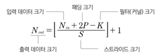

# 항공사진
## 베이스라인 모델

### 1. 시드값 고정 및 GPU 장비 설정
- 파이토치 임포트하고 시드값 (머신러닝의 random_state 같은 역할) 고정
- 시드값 고정하는 이유는 다시 실행해도 같은 결과 얻기 위해서

- 연산에 이용할 장비 할당
```python
if torch.cuba.is_available():
    device = torch.device('cuba')
else:
    device = torch.device('cpu')
```


### 2. 데이터 준비


1. 훈련/검증 데이터 분리
```python
train, valid = train_test_split(lables, test_size=0.1, stratify=labels['has_cactus'], random_state=50)
```
- 훈련, 검증 데이터 타깃값 비율 설정

2. 데이터셋 클래스 정의
```python
class ImageDataset(Dataset):
    
    # 생성자
    def __init__(self, df, img_dir='./', transform=None):
        self.df = df
        self.img_dir = img_dir
        self.transform = transform
    
    # 데이터셋 크기 반환
    def __len__(self):
        return len(self.df)
    
    # 인덱스에 해당하는 데이터 반환
    def __getitem__(self, idx):
        img_id = self.df.iloc[idx, 0]
        # 이미지 파일 경로
        img_path = self.img_dir + img_id

        # 이미지 파일 읽기
        image = cv2.imread(img_path)

        # 이미지 색상 보정
        image = cv2.cvtColor(image, cv2.COLOR_BGR2RGB)

        # 이미지 레이블 (타깃값)
        label = self.df.iloc[idx, 1]

        if self.transform is not None:
            image = self.transform(image)
        return image, label
```
- 추상클래스 Dataset 오버라이딩 필요

```python
from torchvision import transforms

transform = transforms.ToTensor()
```
- 파이토치 모델로 이미지 다루기 위해서 이미지 데이터 tensor 타입으로 변환
- (가로 픽셀, 세로 픽셀, 채널 수) -> (채널 수, 가로 픽셀, 세로 픽셀) 형상으로 변경
- (32 * 32 * 3) 형상의 이미지 데이터가 (3 * 32 * 32)로 변경 -> 최초의 채널 수 = 3(색상)
- 배치 크기 고려하면 (32 * 3 * 32 * 32)의 데이터 형상

3. 데이터셋 생성   
```python
dataset_train = ImageDataset(df=train, img_dir='train/', transform=transform)

dataset_valid = ImageDataset(df=valid, img_dir='train/', transform=transform)
```

4. 데이터 로더 생성
- 지정한 배치 크기 만큼씩 데이터 불러오는 객체


### 3. 모델 생성
**합성곱 신경망(CNN) 모델**


```python
import torch
import torch.nn as nn
import torch.nn.functional as F

class Model(nn.Module):
    def __init__(self):
        super().__init__()
        
        # 첫 번째 합성곱 계층 정의
        self.conv1 = nn.Conv2d(in_channels=3, out_channels=32, kernel_size=3, padding=2)
        
        # 두 번째 합성곱 계층 정의
        self.conv2 = nn.Conv2d(in_channels=32, out_channels=64, kernel_size=3, padding=2)
        
        # 최대 풀링 계층 정의
        self.max_pool = nn.MaxPool2d(kernel_size=2)
        
        # 평균 풀링 계층 정의
        self.avg_pool = nn.AvgPool2d(kernel_size=2)
        
        # 완전 연결 계층 정의
        self.fc = nn.Linear(in_features=64 * 4 * 4, out_features=2)

    def forward(self, x):
        # 첫 번째 합성곱 계층을 통과시키고 ReLU 활성화 함수 적용
        x = self.max_pool(F.relu(self.conv1(x)))
        
        # 두 번째 합성곱 계층을 통과시키고 ReLU 활성화 함수 적용
        x = self.max_pool(F.relu(self.conv2(x)))
        
        # 평균 풀링 적용
        x = self.avg_pool(x)
        
        # 완전 연결 계층에 입력하기 위해 텐서 펼치기
        x = x.view(-1, 64 * 4 * 4)
        
        # 완전 연결 계층을 통과
        x = self.fc(x)
        
        return x
```
- **Conv2d** : 필터 하나가 하나의 출력 채널을 생성하므로 `out_channels`는 채널 수와 동일
- **완전 연결 계층 정리** : `in_features` 파라미터에는 입력값 개수를, `out_features` 파라미터에는 최종 출력값 개수 전달




>전체 과정

```python
model = Model().to(device)
```
- 정의한 Model 클래스로 CNN 모델 생성하여, device 장비에 할당 
- 현재의 device는 GPU 사용하도록 설정

```python
Model(
    (conv1): Conv2d(3, 32, kernel_size=(3, 3), stride=(1, 1), padding=(2, 2))
    (conv2): Conv2d(32, 64, kernel_size=(3, 3), stride=(1, 1), padding=(2, 2))
    (max_pool): MaxPool2d(kernel_size=2, stride=2, padding=0, dilation=1, ceil_mode=False)
    (avg_pool): AvgPool2d(kernel_size=2, stride=2, padding=0)
    (fc): Linear(in_features=1024, out_features=2, bias=True)
)
```

### 4. 모델 훈련
1. **손실함수 설정**
```python
criterion = nn.CrossEntropyLoss()
```

2. **옵티마이저 설정**
```python
optimizer = torch.optim.SGD(model.parameters(), lr=0.01)
```
- 확률적 경사 하강법 이용한 옵티마이저 SGD 사용
- 최적 가중치 찾아주는 알고리즘
- 학습률 (learning rate)

#### 모델 훈련 과정


#### 에폭, 배치 크기, 반복 횟수의 개념

- **에폭** : 훈련 데이터 한 번 훑었음을 의미
- **배치 크기** : 매 훈련 이터레이션에서 한 번에 훈련할 데이터 개수
- **반복 횟수** : 1에폭의 훈련을 완료하는 데 필요한 훈련 이터레이션 (훈련 데이터 수/배치 크기)


```python
epochs = 10  # 총 에폭

# 총 에폭만큼 반복
for epoch in range(epochs):
    epoch_loss = 0  # 에폭별 손실값 초기화

    # '반복 횟수'만큼 반복
    for images, labels in loader_train:
        # 이미지, 레이블 데이터를 미니배치로 장비에 할당
        images = images.to(device)
        labels = labels.to(device)

        # 옵티마이저 내 기울기 초기화
        optimizer.zero_grad()

        # 순전파 : 이미지 데이터를 신경망 모델의 입력값으로 사용해 출력값 계산
        outputs = model(images)

        # 손실 함수를 활용해 outputs와 labels의 손실값 계산
        loss = criterion(outputs, labels)

        # 현재 배치에서의 손실 추가
        epoch_loss += loss.item()  # 역전파 수행
        loss.backward()

        # 가중치 갱신
        optimizer.step()

    # 훈련 데이터 손실값 출력
    print(f'에폭 [{epoch+1}/{epochs}] - 손실값: {epoch_loss/len(loader_train):.4f}')

```
### 5. 성능 검증
```python
from sklearn.metrics import roc_auc_score

# 실젯값
true_list = []
# 예측 확률
preds_list = []

model.eval()  # 모델을 평가 상태로 설정

with torch.no_grad():  # 기울기 계산 비활성화
    for images, labels in loader_valid:  # 이미지, 레이블 데이터를 미니배치로 장비에 할당
        images = images.to(device)
        labels = labels.to(device)

        # 순전파 : 이미지 데이터를 신경망 모델의 입력값으로 사용해 출력값 계산
        outputs = model(images)

        # 출력값인 output을 softmax 함수로 넘겨 타깃값이 0일 확률과 1일 확률 계산
        preds = torch.softmax(outputs.cpu(), dim=1)[:, 1]  
        true = labels.cpu()  # 실제값

        # 예측 확률과 실제값을 리스트에 추가
        preds_list.extend(preds)
        true_list.extend(true)

# 검증 데이터 ROC AUC 점수 계산
print(f'검증 데이터 ROC AUC : {roc_auc_score(true_list, preds_list):.4f}')

```


## 성능 개선


### 1. 이미지 변환
- 확보한 데이터가 부족할 때 특히 유용
- 이미지를 변환하여 데이터 수를 늘리는 방식을 데이터 증강이라고 함
- 훈련 시에는 모델을 다양한 상황에 적응시키는 게 좋지만, 평가 및 테스트 시에는 원본 이미지와 너무 달라지면 예측 어려워짐

```python
from torchvision import transforms  # 이미지 변환을 위한 모듈

# 훈련 데이터용 변환기
transform_train = transforms.Compose([
    transforms.ToTensor(),  # 텐서로 변환
    transforms.Pad(32, padding_mode='symmetric'),  # 패딩 추가
    transforms.RandomHorizontalFlip(),  # 랜덤 수평 뒤집기
    transforms.RandomVerticalFlip(),  # 랜덤 수직 뒤집기
    transforms.RandomRotation(10),  # 랜덤 회전 (10도 이내)
    transforms.Normalize((0.485, 0.456, 0.406), (0.229, 0.224, 0.225))  # 정규화
])


# 검증 및 테스트 데이터용 변환기
transform_test = transforms.Compose([
    transforms.ToTensor(),
    transforms.Pad(32, padding_mode='symmetric'),
    transforms.Normalize((0.485, 0.456, 0.406), (0.229, 0.224, 0.225))
])
```

- **정규화** : 이미지 데이터의 색상은 빨강, 초록, 파랑으로 구성되어 있는데, 각각의 색을 정규화해야 하므로 평균과 분산에 값을 세개씩 전달
- Random 변환기는 변환을 무작위로 가하기 때문에 에폭마다 서로 다른 이미지로 훈련하는 효과 (데이터 증강 기법)

### 2. 모델 생성 (더 깊은 CNN)

- 배치 정규화 적용 (앞선 합성곱의 out_channel 출력 채널 개수 파라미터로 전달)
- 활성화 함수를 Leaky ReLU로 변경 (일반 ReLU 함수보다 성능 향상)
- transform.Pad 이용하여 패드 추가했으므로 초기 이미지 형상 (32, 3, 96, 96)이므로, 전결합 계층 두개 정의

```python
self.fc1 = nn.Linear(in_features=512 * 1 * 1, out_features=64)
self.fc2 = nn.Linear(in_features=64, out_features=2)
```


### 3. 모델 훈련
- 옵티마이저 Adamax으로 변경 
- 학습률 0.00006으로 낮게 설정
- 에폭 70번으로 증가

```python
optimizer = torch.optim.Adamax(model.parameters(), lr=0.00006)
```
