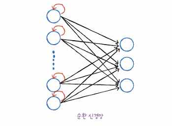
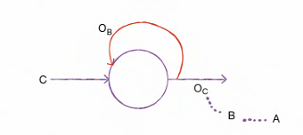
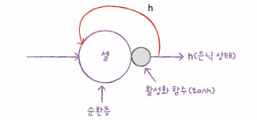
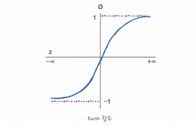

# 9-1 순차 데이터와 순환 신경망

## 순차 데이터
- 텍스트나 시계열 데이터와 같이 순서에 의미가 있는 데이터 (단어의 순서 중요)

### 파워포워드 신경망
- 데이터 프름이 앞으로만 전달되는 신경망

## 순환 신경망
- 일반적인 완전 연결 신경망과 유사
- 완전 연결 신경망에 이전 데이터의 처리 흐름을 순환하는 고리 추가
- 뉴런의 출력이 다시 자기 자신으로 전달

- **타임 스텝**: 샘플을 처리하는 한 단계
- **셀**: 층 (순환신경망에서)
- **은닉 상태**: 셀의 출력

> 이전 샘플에 대한 기억을 가지고 있음
> 순환 신경망은 이전 타임스텝의 샘플 기억하지만, 타임스텝이 오래될 수록 순환되는 정보 희미해짐
>  완전 연결 신경망과 달리 뉴런을 모두 표시하지 않고, 하나의 셀로 층을 표현

- **충의 출력을 다음 타임 스텝에 재사용**

### 활성화 함수
- **하이퍼볼릭 탄젠트 함수 tanh**
