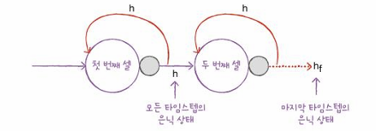

# 9-1 순차 데이터와 순환 신경망

## 순차 데이터
- 텍스트나 시계열 데이터와 같이 순서에 의미가 있는 데이터 (단어의 순서 중요)

### 파워포워드 신경망
- 데이터 프름이 앞으로만 전달되는 신경망

## 순환 신경망
- 일반적인 완전 연결 신경망과 유사
- 완전 연결 신경망에 이전 데이터의 처리 흐름을 순환하는 고리 추가
- 뉴런의 출력이 다시 자기 자신으로 전달

- **타임 스텝**: 샘플을 처리하는 한 단계
- **셀**: 층 (순환신경망에서)
- **은닉 상태**: 셀의 출력

> 이전 샘플에 대한 기억을 가지고 있음

> 순환 신경망은 이전 타임스텝의 샘플 기억하지만, 타임스텝이 오래될 수록 순환되는 정보 희미해짐

>  완전 연결 신경망과 달리 뉴런을 모두 표시하지 않고, 하나의 셀로 층을 표현

- **충의 출력을 다음 타임 스텝에 재사용**

### 활성화 함수
- **하이퍼볼릭 탄젠트 함수 tanh**

- 0 ~ 1 사이의 범위를 가지는 시그모이드 함수와 달리 -1 ~ 1 사이의 범위를 가짐

- 타임스텝 1에서 셀의 출력이 타임스텝 2의 셀로 주입되고, 마찬가지로 타임스텝 2의 셀의 출력이 타입스텝 3의 셀로 주입
- 타임스텝 마다 동일한 가중치 (은닉층, 입력값에 대해) 사용

### 셀의 가중치와 입출력

- 입력층과 순환층의 뉴런이 모두 연결되므로 가중치 크기는 4 * 3 = 12

- 뉴런의 은닉상태가 다음 타임스텝에 재사용될 때 다른 뉴런에 전달되므로 가중치 크기는 3 * 3 = 9

- 각 뉴런마다 하나의 절편 존재하므로 12 + 9 + 3 = 24개 모델 파라미터 존재

### 다층 순환 신경망

- 시퀀스 길이 (단어개수)와 단어 표현(벡터)의 2차원 배열 입력
- 순환층 통과하면 1차원 배열 순환층의 뉴런 개수만큼 출력

- 셀의 입력은 샘플마다 타임스텝과 단어 표현으로 이루어진 2차원 배열이어야 함
- 첫번째 셀이 마지막 타임스텝의 은닉 상태만 출력해서는 안됨
- 첫번째 셀은 모든 타임스텝의 은닉 상태 출력하고, 두번째 셀은 마지막 타임스텝의 은닉 상태만 출력

### 순환곱 신경망 출력층 예시

- 마지막 셀의 출력이 1차원이기 때문에 Flatten 클래스로 펼칠 필요 없음
- 순환층 셀을 모두 통과, 모든 타임스텝 처리하고 난 후의 은닉 상태만 출력
- 은닉 상태의 크기는 셀의 뉴런 개수가 되므로 (10,)
