## LSTM 구조
- Long Short-Term Memory
- 단기 기억을 오래 기억하기 위해 고안됨

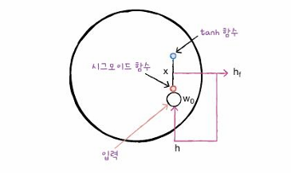

**LSTM의 순환 상태**
- 은닉 상태 (h)
- **셀 상태** : 다음 층으로 전달되지 않고 LSTM 셀에서 순환만 되는 값 (c)

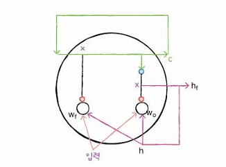

- 입력과 은닉 상태를 또 다른 가중치 w에 곱한 다음 시그모이드 함수 통과 
- 이전 타임스텝의 셀 상태와 곱하여 새로운 셀 상태 생성 
- tanh 함수 통과하여 새로운 은닉 상태 생성

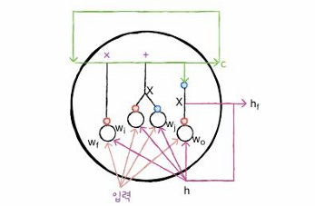

- 2개의 작은 셀 추가되어 셀 상태 만드는 데 기여
- 입력과 은닉 상태를 각기 다른 가중치에 곱함
- 하나는 시그모이드 함수, 다른 하나는 tanh 함수 통과
- 두 결과를 곱한 후 이전 셀 상태와 더함

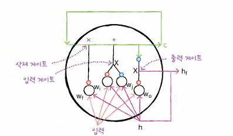

- **삭제 게이트** : 셀 상태에 있는 정보 제거하는 역할 
- **입력 게이트** : 새로운 정보를 셀 상태에 추가
- **출력 게이트** : 셀 상태가 다음 은닉 상태로 출력


## LSTM 신경망 훈련하기

```python
from tensorflow.keras.datasets import imdb
from sklearn.model_selection import train_test_split

(train_input, train_target), (test_input, test_target) = imdb.load_data(num_words=500)

train_input, val_input, train_target, val_target = train_test_split(train_input, train_target, test_size=0.2, random_state=42)
``` 

```python
from tensonflow.keras.preprocessing.sequence import pad_sequences

# 각 샘플의 길이를 100에 맞추고 부족할 때 패딩 추가
train_seq = pad_sequences(train_input, maxlen=100)
val_seq = pad_sequences(val_input, maxlen=100)
```

```python
# LSTM 셀을 사용한 순환층 만들기
from tensorflow import keras

model = keras.Sequential()
model.add(keras.layers.Embedding(500, 16, input_length=100))
model.add(keras.layers.LSTM(8))
model.add(keras.layers.Dense(1, activation='sigmid'))
```

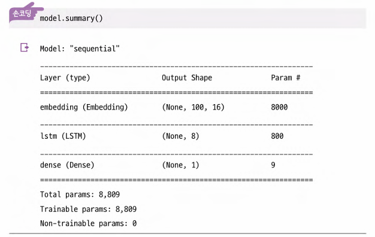

- LSTM 셀에는 작은 셀이 4개 있으므로, SimpleRNN 클래스의 모델 파라미터 개수의 정확히 4배 800개

```python
rmsprop = keras.optimizers.RMSprop(learning_rate=1e-4)
model.compile(optimizer=rmsprop, 

# 손실함수
loss='binary_crossentropy', metrics=['accuracy'])
checkpoint_cb = keras.callbacks.ModelCheckpoint('best-lstm-model.h5')

# 조기 종료
early_stopping_cb = keras.callbacks.EarlyStopping(patience=3, restore_best_weights=True)

# 모델 훈련
history = model.fit(train_seq, train_target, epochs=100, batch_size=64, validation_data=(val_seq, val_target), callbacks=[checkpoint_cb, early_stopping_cb])
```

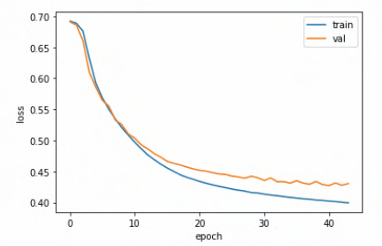


### 순환층에 드롭아웃 적용하기
- 모델이 훈련 세트에 너무 과대적합되는 것 방지
- 순환층은 자체적으로 드롭아웃 기능 제공
- `dropout` 매개변수 : 셀의 입력에 드롭아웃 적용
- `recurrent_dropout` 매개변수 활용 : 순환되는 은닉 상태에 드롭아웃 적용 (GPU 사용하여 모델 훈련하지 못함)

```python
model2 = keras.Sequential()
model2.add(keras.layers.Embedding(500, 16, input_length=100))
model2.add(keras.layers.LSTM(8, dropout=0.3))
model2.add(keras.layers.Dense(1, activation='sigmoid'))
```

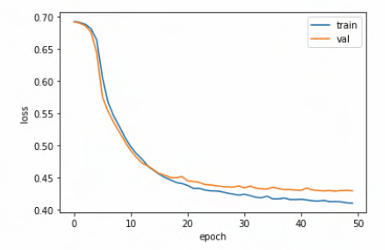

- 훈련 손실과 검증 손실 간의 차이 좁혀짐


### 2개 층 연결하기
- 순환층의 은닉 상태는 샘플의 마지막 타임스텝에 대한 은닉상태만 다음 층으로 전달
- 순환층 쌓게 되면 모든 순환층에 순차 데이터 필요
- **즉, 모든 타임스텝에 대한 은닉 상태 출력 필요**

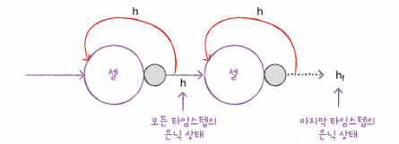

```python
model3 = keras.Sequential()
model3.add(keras.layers.Embedding(500, 16, input_length=100))

# return_sequences 매개변수 지정
model3.add(keras.layers.LSTM(8, dropout=0.3, return_sequences=True))
model3.add(keras.layers.LSTM(8, dropout=0.3))
model3.add(keras.layers.Dense(1, activation='sigmoid'))
```

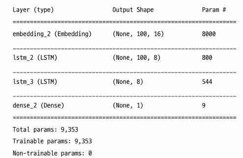

- 첫 번째 LSTM 층이 모든 타임스텝(100개)의 은닉 상태 출력 (None, 100, 8)
- 두 번째 LSTM 층의 출력 크기는 마지막 타임스텝의 은닉상태만 출력하기 때문에 (None, 8)


## GRU 구조
- Gated Recurrent Unit
- LSTM 간소화한 버전
- LSTM처럼 셀 상태를 계산하지 않고 은닉상태 하나만 포함
- 은닉 상태와 입력에 가중치를 곱하고 절편을 더하는 작은 셀 3개로 구성
- 2개는 `시그모이드 활성화 함수` 사용
- 나머지 하나는 `tanh 활성화 함수` 사용

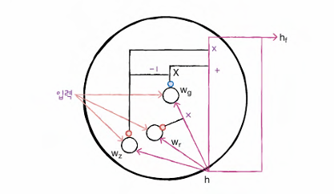

- **삭제 게이트** : 맨 왼쪽에서 wz 사용하는 셀의 출력이 은닉 상태에 바로 곱해져 삭제 게이트 역할 수행
- **입력 게이트** : 이와 동일한 출력을 1애서 뺀다음 가장 오른쪽 wg 사용하는 셀의 출력에 곱함
- 가운데 wt를 사용하는 셀에서 출력된 값은 wg 셀이 사용할 은닉 상태 정보 제어

### GRU 신경망 훈련하기
```python
model4 = keras.Sequential()
model4.add(keras.layers.Embedding(500, 16, input_length=100))
model4.add(keras.layers.GRU(8))
model4.add(keras.layers.Dense(1, activation='sigmoid'))
```

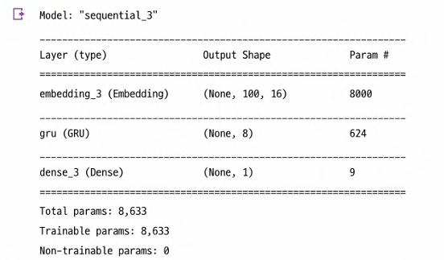

- 입력에 곱하는 가중치 16 * 8 = 128개
- 은닉 상태에 곱하는 가중치 8 * 8 = 64개
- 뉴런마다 절편 하나씩 8개
> (128 + 64 + 8) * 3 = 600개

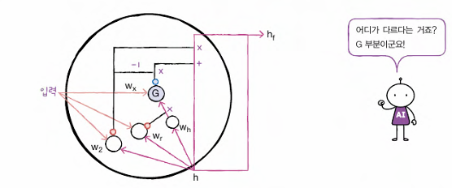

- G로 표시된 작은 셀 추가
- 은닉 상태가 먼저 가중치와 곱해진 다음 가운데 셀의 출력과 곱해짐
- 입력과 은닉 상태에 곱해지는 가중치 wx와 wh로 나뉘어짐
- 작은 셀 하나씩 절편 추가되고 8개 뉴런 있으므로 3 * 8 = 24개
- 총 642개의 모델 파라미터 개수